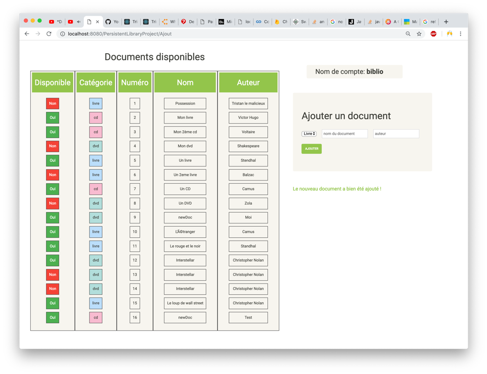

# Library-Web-App
Web JEE application with data persistence (MySQL) using JDBC. 
For more details, read the "Dossier.pdf" file.

<h2>Secured connection</h2>

<h2>Booking a document</h2>

<h3>Before booking</h3>

<h3>After booking</h3>

<h2>Add a document</h2>

